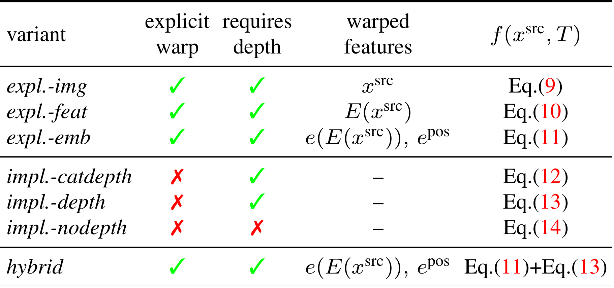

# Geometry-Free View Synthesis: Transformers and no 3D Priors


[**Geometry-Free View Synthesis: Transformers and no 3D Priors**](https://compvis.github.io/geometry-free-view-synthesis/)<br/>
[Robin Rombach](https://github.com/rromb)\*,
[Patrick Esser](https://github.com/pesser)\*,
[Björn Ommer](https://hci.iwr.uni-heidelberg.de/Staff/bommer)<br/>
\* equal contribution

[arXiv](https://arxiv.org/abs/2104.07652) | [BibTeX](#bibtex) | [Colab](https://colab.research.google.com/github/CompVis/geometry-free-view-synthesis/blob/master/scripts/braindance.ipynb)

### Interactive Scene Exploration Results

[RealEstate10K](https://google.github.io/realestate10k/):<br/>
<a href="assets/realestate_short.mp4"></a><br/>
Videos: [short (2min)](assets/realestate_short.mp4) / [long (12min)](assets/realestate_long.mp4)

[ACID](https://infinite-nature.github.io/):<br/>
<a href="assets/acid_short.mp4"></a><br/>
Videos: [short (2min)](assets/acid_short.mp4) / [long (9min)](assets/acid_long.mp4)

### Demo

For a quickstart, you can try the [Colab
demo](https://colab.research.google.com/github/CompVis/geometry-free-view-synthesis/blob/master/scripts/braindance.ipynb),
but for a smoother experience we recommend installing the local demo as
described below.

#### Installation

The demo requires building a PyTorch extension. If you have a sane development
environment with PyTorch, g++ and nvcc, you can simply

```
pip install git+https://github.com/CompVis/geometry-free-view-synthesis#egg=geometry-free-view-synthesis
```

If you run into problems and have a GPU with compute capability below 8, you
can also use the provided conda environment:

```
git clone https://github.com/CompVis/geometry-free-view-synthesis
conda env create -f geometry-free-view-synthesis/environment.yaml
conda activate geofree
pip install geometry-free-view-synthesis/
```

#### Running

After [installation](#installation), running

```
braindance.py
```

will start the demo on [a sample scene](http://walledoffhotel.com/rooms.html).
Explore the scene interactively using the `WASD` keys to move and `arrow keys` to
look around. Once positioned, hit the `space bar` to render the novel view with
GeoGPT.

You can move again with WASD keys. Mouse control can be activated with the m
key. Run `braindance.py <folder to select image from/path to image>` to run the
demo on your own images. By default, it uses the `re-impl-nodepth` (trained on
RealEstate without explicit transformation and no depth input) which can be
changed with the `--model` flag. The corresponding checkpoints will be
downloaded the first time they are required. Specify an output path using
`--video path/to/vid.mp4` to record a video.

```
> braindance.py -h
usage: braindance.py [-h] [--model {re_impl_nodepth,re_impl_depth,ac_impl_nodepth,ac_impl_depth}] [--video [VIDEO]] [path]

What's up, BD-maniacs?

key(s)       action                  
=====================================
wasd         move around             
arrows       look around             
m            enable looking with mouse
space        render with transformer 
q            quit                    

positional arguments:
  path                  path to image or directory from which to select image. Default example is used if not specified.

optional arguments:
  -h, --help            show this help message and exit
  --model {re_impl_nodepth,re_impl_depth,ac_impl_nodepth,ac_impl_depth}
                        pretrained model to use.
  --video [VIDEO]       path to write video recording to. (no recording if unspecified).
```

## Training

### Data Preparation

We support training on [RealEstate10K](https://google.github.io/realestate10k/)
and [ACID](https://infinite-nature.github.io/). Both come in the same [format as
described here](https://google.github.io/realestate10k/download.html) and the
preparation is the same for both of them. You will need to have
[`colmap`](https://github.com/colmap/colmap) installed and available on your
`$PATH`.

We assume that you have extracted the `.txt` files of the dataset you want to
prepare into `$TXT_ROOT`, e.g. for RealEstate:

```
> tree $TXT_ROOT
├── test
│   ├── 000c3ab189999a83.txt
│   ├── ...
│   └── fff9864727c42c80.txt
└── train
    ├── 0000cc6d8b108390.txt
    ├── ...
    └── ffffe622a4de5489.txt
```

and that you have downloaded the frames (we downloaded them in resolution `640
x 360`) into `$IMG_ROOT`, e.g. for RealEstate:

```
> tree $IMG_ROOT
├── test
│   ├── 000c3ab189999a83
│   │   ├── 45979267.png
│   │   ├── ...
│   │   └── 55255200.png
│   ├── ...
│   ├── 0017ce4c6a39d122
│   │   ├── 40874000.png
│   │   ├── ...
│   │   └── 48482000.png
├── train
│   ├── ...
```

To prepare the `$SPLIT` split of the dataset (`$SPLIT` being one of `train`,
`test` for RealEstate and `train`, `test`, `validation` for ACID) in
`$SPA_ROOT`, run the following within the `scripts` directory:

```
python sparse_from_realestate_format.py --txt_src ${TXT_ROOT}/${SPLIT} --img_src ${IMG_ROOT}/${SPLIT} --spa_dst ${SPA_ROOT}/${SPLIT}
```

You can also simply set `TXT_ROOT`, `IMG_ROOT` and `SPA_ROOT` as environment
variables and run `./sparsify_realestate.sh` or `./sparsify_acid.sh`. Take a
look into the sources to run with multiple workers in parallel.

Finally, symlink `$SPA_ROOT` to `data/realestate_sparse`/`data/acid_sparse`.

### First Stage Models
As described in [our paper](https://arxiv.org/abs/2104.07652), we train the transformer models in 
a compressed, discrete latent space of pretrained VQGANs. These pretrained models can be conveniently
downloaded by running
```
python scripts/download_vqmodels.py 
```
which will also create symlinks ensuring that the paths specified in the training configs (see `configs/*`) exist.
In case some of the models have already been downloaded, the script will only create the symlinks.

For training custom first stage models, we refer to the [taming transformers
repository](https://github.com/CompVis/taming-transformers).

### Running the Training
After both the preparation of the data and the first stage models are done, 
the experiments on ACID and RealEstate10K as described in our paper can be reproduced by running
```
python geofree/main.py --base configs/<dataset>/<dataset>_13x23_<experiment>.yaml -t --gpus 0,
```
where `<dataset>` is one of `realestate`/`acid` and `<experiment>` is one of 
`expl_img`/`expl_feat`/`expl_emb`/`impl_catdepth`/`impl_depth`/`impl_nodepth`/`hybrid`. 
These abbreviations correspond to the experiments listed in the following Table (see also Fig.2 in the main paper)



Note that each experiment was conducted on a GPU with 40 GB VRAM.

## BibTeX

```
@misc{rombach2021geometryfree,
      title={Geometry-Free View Synthesis: Transformers and no 3D Priors}, 
      author={Robin Rombach and Patrick Esser and Björn Ommer},
      year={2021},
      eprint={2104.07652},
      archivePrefix={arXiv},
      primaryClass={cs.CV}
}
```
