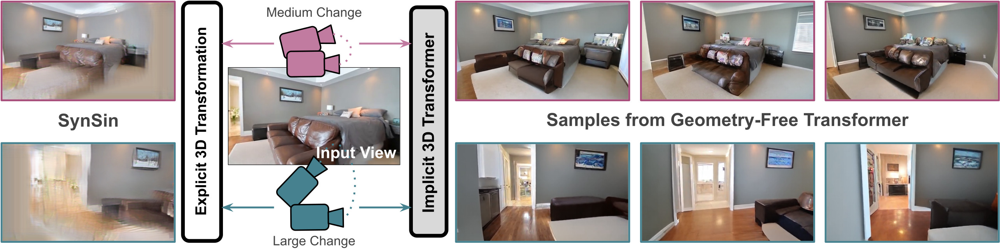

# Geometry-Free View Synthesis: Transformers and no 3D Priors

[**Geometry-Free View Synthesis: Transformers and no 3D Priors**](https://compvis.github.io/geometry-free-view-synthesis/) 
[Robin Rombach](https://github.com/rromb)\*,
[Patrick Esser](https://github.com/pesser)\*,
[Björn Ommer](https://hci.iwr.uni-heidelberg.de/Staff/bommer) 
\* equal contribution

Coming soon.
